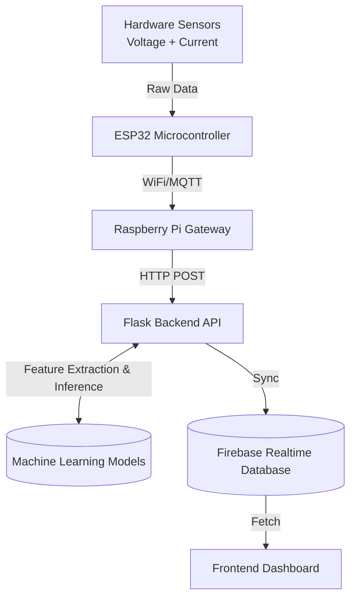

# AI-Based Smart Energy Audit System


An AI-powered IoT platform designed to monitor, analyze, and optimize household and industrial energy consumption. The system collects real-time electrical data using hardware sensors, processes the data through a Raspberry Pi gateway and Flask backend, stores it in Firebase, and provides deep insights using Machine Learning for **Power Forecasting** and **Anomaly Detection**.

---

## 📖 Table of Contents
- [Abstract](#abstract)
- [I. Introduction](#i-introduction)
- [II. Proposed Methodology (How It Works)](#ii-proposed-methodology-how-it-works)
- [III. Key Features](#iii-key-features)
- [IV. System Architecture & Tech Stack](#iv-system-architecture--tech-stack)
- [V. Machine Learning Framework](#v-machine-learning-framework)
- [VI. Repository Structure](#vi-repository-structure)
- [VII. Experimental Setup & Operation](#vii-experimental-setup--operation)
- [VIII. Contributors & Team](#viii-contributors--team)
- [IX. License](#ix-license)

---

## Abstract

The **AI-Based Smart Energy Audit System** is an end-to-end open-source solution built to bring commercial-grade energy auditing directly to homes and small industries. Instead of relying on monthly electricity bills to understand consumption, this system provides a real-time, second-by-second breakdown of electrical usage. 

By combining edge IoT hardware, RESTful APIs, a cloud database, and specialized Machine Learning pipelines, the system not only acts as a smart meter but actively functions as an intelligent auditor. It automatically identifies wasteful consumption patterns, detects deteriorating appliances through electrical anomalies, and accurately forecasts future energy demands.

---

## I. Introduction

Energy consumption is one of the highest operational costs for both households and industries. However, most consumers have zero visibility into *how* their power is being used until the bill arrives. 

1. **Undetected Waste:** Appliances often degrade over time, secretly drawing massive amounts of "vampire power" or operating inefficiently.
2. **Safety Hazards:** Severe power surges and sudden voltage sags can irreparably damage expensive equipment or cause electrical fires.
3. **Lack of Predictive Insights:** Without knowing future power demands, it is impossible to efficiently manage off-grid solar storage or budget for utility costs.

This project solves these issues by bringing transparency to electrical consumption. It empowers users to reduce their carbon footprint, lower electricity bills, and ensure the safety of their electrical infrastructure through proactive AI monitoring.

---

## II. Proposed Methodology (How It Works)

The system operates in a continuous, automated loop connecting physical hardware to cloud AI:

1. **Physical Sensing:** Non-invasive SCT-013 current sensors clip onto the main power lines, while ZMPT101B sensors measure the live voltage.
2. **Edge Processing:** An ESP32 microcontroller rapidly samples these analog signals, calculates the true RMS voltage, current, and instantaneous power, and packages the data.
3. **Gateway Routing:** The ESP32 transmits the data over WiFi/MQTT to a local Raspberry Pi gateway, ensuring data is buffered and reliably forwarded even if the internet connection is unstable.
4. **Backend Ingestion:** A centralized Python Flask REST API receives the telemetry data, cleans it, and prepares it for inference.
5. **AI Analysis:** The data is passed through pre-trained Scikit-Learn models. The **Isolation Forest** checks the exact signature of the power draw for anomalies (like a motor failing), while the **Random Forest Regressor** predicts the power demand for the next time horizon.
6. **Cloud & UI:** The enriched data (raw metrics + AI insights) is pushed to Firebase in real-time, where a frontend web dashboard fetches and displays the live audit to the end-user.

---

## III. Key Features

- **Real-Time Energy Monitoring**: Collects Voltage, Current, and Power data at high frequencies.
- **IoT Data Pipeline**: Seamless transmission from ESP32 edge devices through a Raspberry Pi gateway.
- **RESTful Flask Backend**: Efficiently processes streams of time-series data.
- **Cloud Synchronization**: Stores processed data securely in Firebase for real-time dashboard access.
- **Machine Learning Analytics**:
  - **Power Forecasting**: Predicts absolute power required utilizing lag features to prevent data leakage.
  - **Anomaly Detection**: Unsupervised detection of extreme power surges, voltage sags, and appliance malfunctions.
- **Automated Reporting**: Generates comprehensive `.docx` statistical reports and visual case studies automatically.

---

## IV. System Architecture & Tech Stack

### Architecture Diagram


### 💻 Technologies Utilized

**Hardware & Edge:**
- 🔌 ESP32 Microcontroller
- ⚡ SCT-013 Current Sensor
- 🔌 ZMPT101B Voltage Sensor
- 🍓 Raspberry Pi (Gateway)

**Backend & Data Processing:**
- 🐍 Python 3.9+
- 🌶️ Flask API
- 🐼 Pandas & NumPy for data manipulation

**Machine Learning:**
- 🧠 Scikit-learn
- 🌲 Random Forest Regressor (Forecasting)
- 🌳 Isolation Forest (Anomaly Detection)
- 📦 Joblib (Model Serialization)

**Database & Cloud:**
- 🔥 Firebase Realtime Database

**Reporting & Visualization:**
- 📊 Matplotlib & Seaborn
- 📓 Jupyter Notebooks (`nbconvert`)
- 📄 Python-docx

---

## V. Machine Learning Framework

Our ML pipeline is designed specifically for highly volatile time-series electrical data.

1. **Forecasting (Random Forest Regressor)**: 
   - **Target**: Next timestep's absolute power (`next_p`).
   - **Features**: Current deltas ($\Delta V$, $\Delta I$, $\Delta P$), historical rolling means (`hist_mean_10`, `hist_mean_50`), and lag features (`lag1`, `lag2`, `lag3`) to maintain time-series integrity and entirely eliminate data leakage.
   - **Performance**: Consistently achieves an $R^2$ score $\ge 0.70$ (often $>0.90$ on clean datasets).
   
2. **Anomaly Detection (Isolation Forest)**:
   - Detects abnormal operating behaviors (e.g., massive power surges, sudden voltage drops, or disconnected appliances).
   - Expected contamination rate dynamically calibrated per deployment.

---

## VI. Repository Structure

```text
ai-smart-energy-audit-system/
├── backend/
│   ├── flask-api/
│   │   ├── server.py              # Main Flask server application
│   │   └── requirements.txt       # Python dependencies
│   ├── raw_data.csv               # Sensor data history
│   └── firebase_key.json          # Firebase service account credentials
├── ml-models/
│   ├── rf.py                      # Random Forest training pipeline
│   ├── if.py                      # Isolation Forest training pipeline
│   └── *.pkl                      # Serialized pre-trained models & scalers
├── scripts/
│   ├── generate_synthetic_data.py # Generates baseline data
│   └── simulate_device*.py        # Local IoT hardware simulation scripts
├── docs/
│   ├── energy_audit_statistical_report.docx
│   ├── *.ipynb                    # Executed case study notebooks
│   └── *.png                      # Generated analytics graphs
├── hardware/                      # Circuit diagrams & sensor calibration
├── firmware/                      # ESP32 & Raspberry Pi gateway code
└── frontend/                      # React / Streamlit dashboard source
```

---

## VII. Experimental Setup & Operation

Follow these steps to get the source code, configure the backend, and operate the system locally.

### 1. Get the Source Code
You can clone the open-source repository directly to your local machine using Git:
```bash
git clone https://github.com/your-username/ai-smart-energy-audit-system.git
cd ai-smart-energy-audit-system
```

### 2. Set Up the Python Environment
It is highly recommended to isolate the project dependencies using a Python virtual environment.
```bash
cd backend
python -m venv venv

# Activate on Windows:
.\venv\Scripts\activate

# Activate on Linux/Mac:
source venv/bin/activate
```

### 3. Install Required Packages
Install all necessary Python libraries (Flask, Scikit-Learn, Pandas, etc.):
```bash
pip install -r requirements.txt
```

### 4. Configure the Cloud Database (Firebase)
To allow the backend to sync data to the cloud dashboard:
1. Create a project in the [Firebase Console](https://console.firebase.google.com/).
2. Generate a new Private Key from **Project Settings > Service Accounts**.
3. Download the JSON file and rename it to `firebase_key.json`.
4. Place this file directly inside the `backend/` directory.

### 5. Operate the System (Start the Server)
To begin processing data, start the core Flask API server:
```bash
python server.py
```
*The server will boot up on `http://localhost:5000`. It will automatically load the pre-trained Machine Learning models (`.pkl` files) from the `ml-models/` directory into memory.*

### 6. Feeding Data into the System
Once the server is running, it expects data to be POSTed to the `/data` endpoint. You have two options to operate the data feed:

- **Option A (Real Hardware):** Flash the ESP32 code located in `firmware/esp32-code/` onto your microcontroller. Wire up the SCT-013 and ZMPT101B sensors according to the schematics in the `hardware/` directory. The ESP32 will automatically begin transmitting live electrical readings to your running Flask server.
- **Option B (Simulation):** If you do not have the physical sensors, you can simulate an IoT device from your computer. Open a new terminal, activate your virtual environment, and run:
  ```bash
  cd scripts
  python simulate_device.py
  ```
  This will artificially generate realistic electrical fluctuations and transmit them to your local server, triggering the AI models and Firebase sync just like a real device.

---

## VIII. Contributors & Team

This project is currently developed, backed, and maintained by **Sanjay**. The initial foundation and previous iterations included contributions from the following team members:

| Member | Role / Contribution |
|------|------|
| **Sanjay** | Lead Developer, Machine Learning, DevOps, System Architecture, UI Design |
| **Sarvagya** | Hardware & Firmware Assistance |
| **Jaswanth** | Backend API Assistance |
| **Asmit** | Frontend & Database Assistance |

---

## IX. License

This project is licensed under the **MIT License**. Feel free to use, modify, and distribute the code as you see fit for both open-source and commercial applications.
