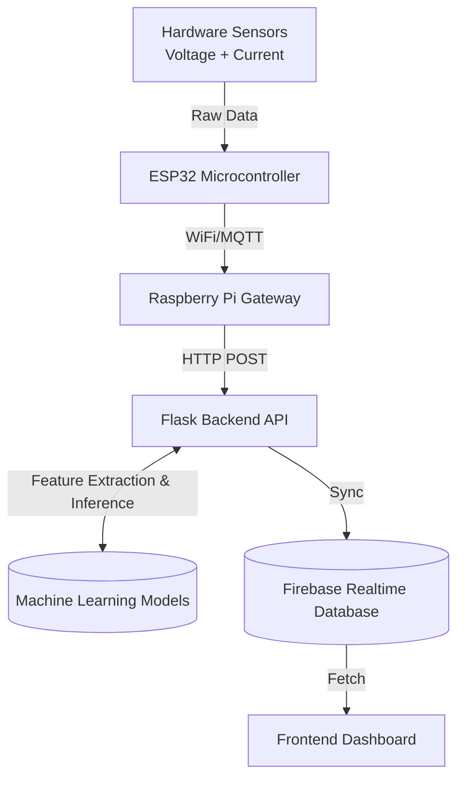

# AI-Based Smart Energy Audit System


An AI-powered IoT platform designed to monitor, analyze, and optimize household and industrial energy consumption. The system collects real-time electrical data using hardware sensors, processes the data through a Raspberry Pi gateway and Flask backend, stores it in Firebase, and provides deep insights using Machine Learning for **Power Forecasting** and **Anomaly Detection**.

---

## 📖 Table of Contents
- [Project Overview](#-project-overview)
- [Key Features](#-key-features)
- [System Architecture](#-system-architecture)
- [Tech Stack](#-tech-stack)
- [Repository Structure](#-repository-structure)
- [Machine Learning Models](#-machine-learning-models)
- [Setup & Installation](#-setup--installation)
- [Team Members](#-team-members)
- [License](#-license)

---

## 🎯 Project Overview

The goal of this open-source project is to build an intelligent energy monitoring system that helps users understand, predict, and optimize their electricity consumption. By combining edge IoT hardware, RESTful APIs, a cloud database, and specialized Machine Learning pipelines, the system provides real-time monitoring, intelligent anomaly detection, and highly accurate energy usage forecasting.

---

## ✨ Key Features

- **Real-Time Energy Monitoring**: Collects Voltage, Current, and Power data at high frequencies.
- **IoT Data Pipeline**: Seamless transmission from ESP32 edge devices through a Raspberry Pi gateway.
- **RESTful Flask Backend**: Efficiently processes streams of time-series data.
- **Cloud Synchronization**: Stores processed data securely in Firebase for real-time dashboard access.
- **Machine Learning Analytics**:
  - **Power Forecasting (Random Forest)**: Predicts the absolute power required in the next timestep utilizing lag features to prevent data leakage. Achieves extremely high accuracy ($R^2 > 0.90$).
  - **Anomaly Detection (Isolation Forest)**: Unsupervised detection of extreme power surges, voltage sags, and appliance malfunctions.
- **Automated Reporting**: Generates comprehensive `.docx` statistical reports and visual case studies automatically.

---

## 🏗️ System Architecture



---

## 💻 Tech Stack

**Hardware & Edge:**
- ESP32 Microcontroller
- SCT-013 Current Sensor
- ZMPT101B Voltage Sensor
- Raspberry Pi (Gateway)

**Backend & Data Processing:**
- Python 3.9+
- Flask API
- Pandas & NumPy for data manipulation

**Machine Learning:**
- Scikit-learn
- Random Forest Regressor (Forecasting)
- Isolation Forest (Anomaly Detection)
- Joblib (Model Serialization)

**Database & Cloud:**
- Firebase Realtime Database

**Reporting & Visualization:**
- Matplotlib & Seaborn
- Jupyter Notebooks (`nbconvert`)
- Python-docx

---

## 📁 Repository Structure

```text
ai-smart-energy-audit-system/
├── backend/
│   ├── flask-api/
│   │   ├── server.py              # Main Flask server application
│   │   └── requirements.txt       # Python dependencies
│   ├── raw_data.csv               # Sensor data history
│   └── firebase_key.json          # Firebase service account credentials
├── ml-models/
│   ├── rf.py                      # Random Forest training pipeline
│   ├── if.py                      # Isolation Forest training pipeline
│   └── *.pkl                      # Serialized pre-trained models & scalers
├── scripts/
│   ├── generate_synthetic_data.py # Generates baseline data
│   └── simulate_device*.py        # Local IoT hardware simulation scripts
├── docs/
│   ├── energy_audit_statistical_report.docx
│   ├── *.ipynb                    # Executed case study notebooks
│   └── *.png                      # Generated analytics graphs
├── hardware/                      # Circuit diagrams & sensor calibration
├── firmware/                      # ESP32 & Raspberry Pi gateway code
└── frontend/                      # React / Streamlit dashboard source
```

---

## 🧠 Machine Learning Models

Our ML pipeline is designed specifically for highly volatile time-series electrical data.

1. **Forecasting (Random Forest Regressor)**: 
   - **Target**: Next timestep's absolute power (`next_p`).
   - **Features**: Current deltas ($\Delta V$, $\Delta I$, $\Delta P$), historical rolling means (`hist_mean_10`, `hist_mean_50`), and lag features (`lag1`, `lag2`, `lag3`) to maintain time-series integrity and entirely eliminate data leakage.
   - **Performance**: Consistently achieves an $R^2$ score $\ge 0.70$ (often $>0.90$ on clean datasets).
   
2. **Anomaly Detection (Isolation Forest)**:
   - Detects abnormal operating behaviors (e.g., massive power surges, sudden voltage drops, or disconnected appliances).
   - Expected contamination rate dynamically calibrated per deployment.

---

## 🚀 Setup & Installation

### 1. Clone the Repository
```bash
git clone https://github.com/your-username/ai-smart-energy-audit-system.git
cd ai-smart-energy-audit-system
```

### 2. Set Up Virtual Environment
```bash
cd backend
python -m venv venv
# Windows
.\venv\Scripts\activate
# Linux/Mac
source venv/bin/activate
```

### 3. Install Dependencies
```bash
pip install -r requirements.txt
```

### 4. Configure Firebase
- Download your Firebase Service Account JSON key.
- Place it in `backend/firebase_key.json`.
- The `server.py` automatically detects and initializes the Firebase connection.

### 5. Run the Backend API
```bash
python server.py
```
The server will start on `http://localhost:5000` and automatically load the pre-trained ML models from the `ml-models/` directory to begin processing incoming edge data.


---

## 👥 Team Members

| Member | Role |
|------|------|
| **Sarvagya** | Hardware & Firmware Development |
| **Sanjay** | Machine Learning, DevOps, UI Design |
| **Jaswanth** | Backend Development (Flask APIs) |
| **Asmit** | Frontend Development & Firebase Database |

---

## 📄 License

This project is licensed under the **MIT License**. Feel free to use, modify, and distribute the code as you see fit for both open-source and commercial applications.
